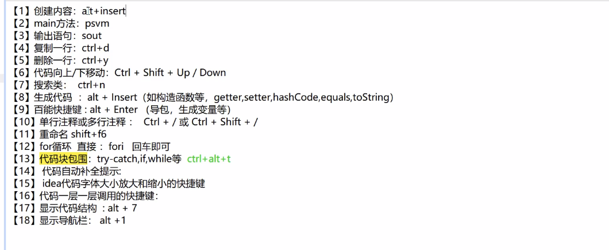
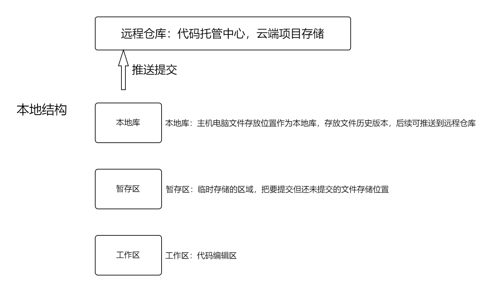
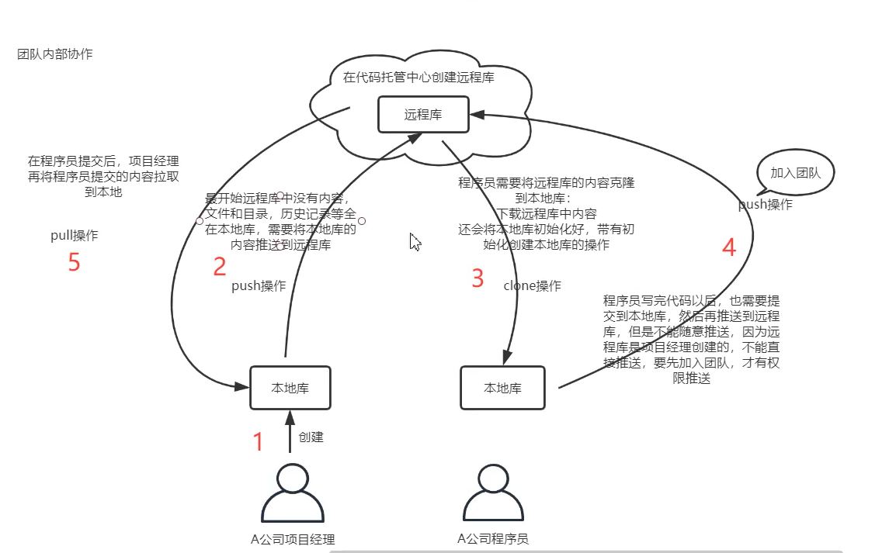
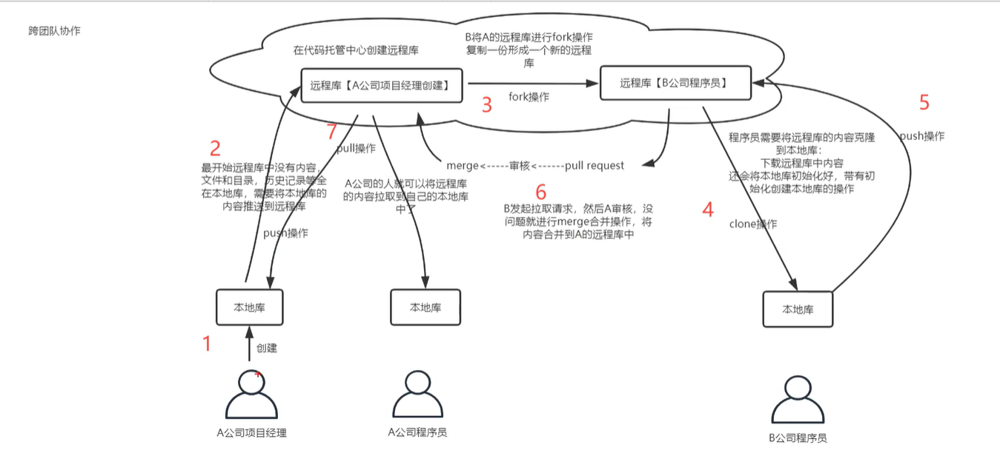
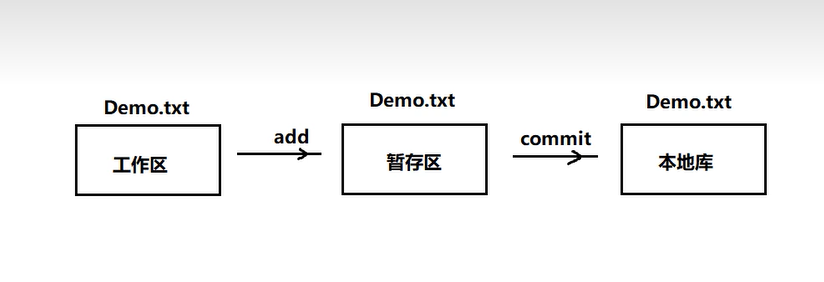
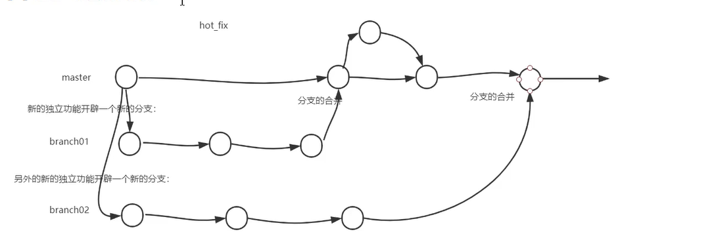

**_本文参考b站视频，做下笔记：https://www.bilibili.com/video/BV19p4y1W7kV/?p=27&spm_id_from=333.1007.top_right_bar_window_history.content.click&vd_source=7970fc9ea7ea3970cfbc8d47c9dadf4b_**

#1、idea配置快捷键



在设置中有两个代码模板，分别是实时模板(Live Templates)以及后缀补全(Postfix Completion)
其中实时模板可以做用户的个性化定制--后缀不全只能使用不能修改。

#2、版本管理工具简介

##2.1、rcs(本地版本控制系统)

**原理：** 在硬盘上(本地，local computer)保存补丁集(文件修订前后的变化)，通过所有的补丁，可以计算出各个版本的文件内容


.webp)

##2.2、svn(集中化版本控制系统)

**原理：** 在一个单一的集中管理的服务器(central server)，保存所有文件的修订版本。协同工作的人们都通过客户端连到这台服务器，取出最新的文件或者提交更新。

.webp)

##2.3、git(分布式版本控制系统)

**原理：** 客户端并不只提取最新版本的文件快照，而是把代码仓库完整地镜像下来。每一次的克隆操作，实际上都是一次对代码仓库的完整备份。

.webp)

    git利用极致的压缩算法，解压算法，将存储的量压缩到跟集中化的svn大不了多少，因此优势特性很突出


#3、Git使用简介

##3.1、安装与结构简介

安装：点击安装程序进行安装，在任何位置右键鼠标出现git bash here与 git gui here，可以打开使用即安装成功。

**本地结构：**



工作区 git add 到 暂存区 git commit 本地库  git push 到 远程仓库

----

**git团队内部合作：**



**git跨团队合作：**



----

##3.2、初始化本地仓库

    （1）、新建文件夹作为本地仓库
    （2）、在本地仓库中打开git bash here，右键可以打开选项设置git bash 界面的字符编码等。
        其中git的命令操作与linux中的一致：
                查看git版本：git --version
                清屏：clear
                设置签名：
                    设置用户名：git config --global user.name "flypig"
                    设置邮箱:git config --global user.email "uuFlypig@163.com"
    （3）、初始化：git init

注意：初始化后的.git文件目录下的文件不能轻易修改，保持不变

##3.3、提交文件到本地仓库

    （1）、准备好需要的文件，在本地仓库目录下，此时文件并没有与本地仓库的git相连接。
    （2）、git add Demo.txt将文件添加到暂存区
    （3）、将暂存区文件提交到本地仓库，创建文件与本地仓库的连接，文件受git管理：
            git commit -m "日志信息" 文件名
注意：不放在本地仓库中的文件，git是不进行管理。即使放在本地仓库的文件，git也不管理，必须经过add，commit命令操作才可以将内容提交到本地仓库。

##3.4、其他常用命令

    （1）、查看工作区与暂存区的文件状态(还没有添加到本地库的文件状态)：git status
    （2）、查看提交的、显示从最近到最远的日志：git log（当历史记录过多的时候，查看日志，需要分页查看，空格执行下一页，按键b执行上一页，尾页会显示END，q退出日志）
                            简洁的展示日志：git log --pretty=oneline 一行行的展示日志
                          更加简洁的展示：git log --oneline  一行行展示日志，且日志索引仅取前7位字母。 
                          信息增加的展示：git reflog（比上一个命令多了信息：HEAD@{数字} 数字的含义是指针回到当前这个历史版本的需要走的步数）
    （3）、前进或者后退历史版本：reset
            git reset 
                    hard参数： --hard + [版本索引]   本地仓库的指针移动的同时，重置暂存区，重置工作区
                    mixed参数：  --mixed + [版本索引]  本地库的指针移动的同时，重置暂存区，但是工作区不动
                    soft参数：   --soft + [版本索引]   本地库的指针移动的时候，暂存区、工作区都不动
    （4）、比对工作区与暂存区的文件差异：git diff + [文件名]  
            将工作区中的文件和暂存区中文件进行比较，删除使用-标记，添加使用+标记。
            （如不添加文件名，即不指定文件比对，比较的是工作区和暂存区中的所有文件的差异）
            git diff [文件版本索引] + [文件名]：如果添加索引，表示暂存区的文件与该版本的历史文件进行比对差异。
    （5）、查看已经存放到本地仓库的文件：git ls -files

  
注意：使用较多的都是第一种hard参数。
整体流程：将文件add到暂存区-->通过commit提交到本地库

##3.5、提交分支相关简介



(1)、分支是使用多条线同时推进多个任务。

(2)、分支带来的好处是可以并行开发，互相不耽误，互相不影响，提高开发效率

(3)、分支相关命令

    查看分支：git branch -v  (分支前方的*号表示现在所处的分支是哪个)
    创建分支：git branch (分支名称)  
    切换分支：git checkout (分支名称)
    合并分支：git merge (分支名称) ---在主分支的身份下执行合并

(4)、分支冲突问题

    问题缘由：在不同的分支中操作同一个文件，且修改的文件内容在同一位置，在合并分支文件的时候产生了冲突，git不知道如何保留文件，此时显示处于在合并状态中(master|MERGING)
    解决方法：与分支创建者沟通，保留某一分支内容，或者二者均保留，在执行合并分支的命令后，修改文件，将冲突修改，再提交。
            修改文件后，add到暂存区中，再提交，提交需要注意，命令为git commit -m "提交信息" --不需要接文件名称，直接提交，提交成功并退出合并状态。

注意：以上小节为git在本地仓库的使用，以下介绍GIT操作远程仓库。

----
  

##3.6、Git远程仓库操作简介

_以下为命令行方式操作_

    操作步骤：
            1、首先在GitHub或Gittee等远程仓库建立远程库,与需要推送的本地库同名
            2、复制远程仓库地址，在本地仓库的git命令行中创建地址别名：
                查看远程地址：git remote -v (查看已设置的远程地址)
                添加远程库地址：git remote add 别名(origin) + http地址(https://github.com/uuFlyPig/dailyStudy.git)
            3、推送远程库：git push 远程库别名(origin) +推送分支(master)
            4、克隆远程库：git clone +远程库地址
注意：克隆操作可以帮助完成三件事情，首先克隆下来的文件夹中已经初始化好了git本地库，其次将远程库内容完整克隆到本地，最后，将克隆下来的远程库地址创建好别名。

协同开发步骤：

    1、项目负责人创建远程库，将代码推送到远程库管理，项目负责人邀请开发人员加入团队(setting-->Access-->Collaborators-->Manage access)：路径
    2、开发者可以clone到本地进行开发，开发完毕后将代码再push到远程仓库(如未加入团队则push报错)
    3、开发者同步到远程仓库后，项目负责人本地的代码就与远程仓库有出入，需要拉取到其本地中查看代码，因此涉及到负责人从远程仓库中拉取到本地
        拉取：pull = (fetch + merge) ,fetch表示抓取的意思，merge表示合并的意思。
             git fetch 远程库别名(origin) + 分支(master):fetch仅将远程库内容下载到本地仓库中，但是并没有更新到本地工作区
             此时可以通过切换分支到远程仓库的中插卡看内容是否符合：git checkout origin/master
        进行合并：(切换回来后操作) git merge origin/master 即合并
        以上的抓取与合并可以通过一个命令pull完成：git pull 远程库(origin) master
        注意：fetch + merge操作--》保险，降低风险
             pull操作---》代码简单，便捷

协同开发分支提交产生的冲突问题：

    问题原因：不同的人操作同一个文件的同一个位置的时候，引起冲突
    解决方法：在冲突的情况下，先拉取下来，然后修改冲突，然后再推送到远程服务器，人为解决冲突。解决完后再推送，提交中不带文件名


**跨团队操作：**

    1、另一个团队需要将项目fork复制到自己的远程库中，团队程序员克隆远程库的项目到本地库中，下载远程库的同时还会将本地库初始化好，带有初始化创建本地库操作
    2、当另一团队开发完后，提交到自身远程库，再通过远程库的推送请求，pull request给本团队审核进行merge。


**SSH免密登录方式：**

    (1) 进入用户的主目录中(cd ~)
    (2) 执行命令，生成一个.ssh的文件---ssh-keygen -t rsa -C +github注册账号对应的邮箱
    (3) 复制.ssh目录下的id_rad.pub文件，将公钥复制到github上，在github  setting上设置SSH Keys
    (4) 在github上生成密钥后，就可以正常进行push操作了
    (5) 可以对ssh远程地址起别名：
            git remote origin_ssh + ssh密钥


----

##3.7、idea集成git

**_本地仓库交互：_**

    1、创建项目，在设置中配置git路径等。创建的一个项目就是工作区，项目所在目录就是本地仓库所在目录
    2、在idea界面中选择VSC创建git仓库，即可完成本项目初始化，生成.git目录。
    3、提交方式：
            右键新建的文件，选择git添加，即可添加到暂存区，再次点击提交即可提交到本地仓库，再次点击推送即可推送到远程仓库(需要配置远程仓库地址)
            文件如未添加到暂存区则是微红色显示，如添加到暂存区还未提交到本地仓库则是绿色，如提交到本地仓库后则是正常颜色，且在文件中如修改了文件则会有提示差异代码

**_远程仓库交互：_**

    1、如需要在idea中实现本地仓库与远程仓库进行关联，可以先把远程仓库拉取下来，然后再推送到远程仓库中达到合并目的。
    2、需要注意：远程仓库与本地仓库实现关联进行拉取的时候，因为是不同的两个项目需要添加依据代码，在git pull之后
            git pull origin(仓库地址) master(仓库分支) --allow-unrelated-histories
        此命令告诉git允许不相关历史合并，解决了两个仓库有不同的开始点，也就是两个仓库没有共同的commit出现的无法提交的问题。
        如使用此命令还无法提交，则看看是否是产生了冲突，解决冲突后再提交。
    3、push推送：git push -u origin master -f

## 3.8、实操案例

1、当在idea修改文件，或者添加文件后，需要添加暂存区、提交，后续即推送远程库

2、在推送过程中，首先可以尝试直接push，push完后如无问题即可，push失败则需要通过命令行的方式进行一些操作

    (1) 首先打开命令行，因为本地仓库与远程仓库存在一定的冲突，或者是版本不同步，因此需要在命令窗口执行一些操作

    (2) 执行pull拉取命令解决仓库不同步问题， git pull --rebase gitee master 当出现报错结果时需执行下面命令
        
        依次输入指令：
            a.git stash
            能够将所有未提交的修改（工作区和暂存区）保存至堆栈中，用于后续恢复当前工作目录。意思就是把你 commit 到本地仓库的内容，取出来放到暂存区(stash)（这时你的工作区是干净的）
            
            b.git pull --rebase
            从远端拉取代码到本地，由于工作区是干净的，所以不会有冲突
            
            c.git stash pop（git stash apply）
            从暂存区把你之前提交的内容取出来，跟拉下来的代码合并

        坑:
        
            a.git stash pop ：会将当前stash中的内容弹出，并应用到当前分支对应的工作目录上。该命令将堆栈中最近保存的内容删除（栈是先进后出），这样有时候会发现代码没了。
            保守点可以用：git stash apply ：将堆栈中的内容应用到当前目录，不同于git stash pop，该命令不会将内容从堆栈中删除，也就说该命令能够将堆栈的内容多次应用到工作目录中，适应于多个分支的情况。
            
            b.如果使用 git stash pop 后有冲突时，如何撤销?
            可以使用 git reset --hard ，即可撤销 git stash pop 操作，将当前分支状态恢复。
            而该操作后，git stash 暂存区的记录也不会被删除，可通过 git stash show 查看。

    (3) 执行完后再执行抓取仓库命令，合并仓库，git pull --rebase gitee master 即可合并成功
    (4)之后再执行push即可


#4、附录git指令目录

----

**命令(1)：**

<font color= #871F78>**git config**</font>

**作用：** 在第一次使用 git 或刚安装新的 git 时，此命令可设置身份--Name 和 Eamail 地址，并且每次提交时会使用此信息。

**用法：**

```shell
    git config --global user.name "Your name"
    
    git config --global user.email "Your email"
```

**命令(2)：**

<font color= #871F78>**git version**</font>

**作用：** 检查当前使用的 git 的版本号

**用法：**

```shell
    git version
```

**命令(3)：**

<font color= #871F78>**git init**</font>

**作用：** 初始化 git 仓库，创建新项目时使用的第一个命令，此命令将创建一个空白的新的存储库，然后我们可以将源代码存储在此存储库中。

**用法：**

```shell
    git init
```

**命令(4)：**

<font color= #871F78>**git clone**</font>

**作用：** 将使用现有的存储库进行复制。git init 和 git clone 之间有一个主要区别。需要在现有存储库上进行复制时，使用 git clone 。git clone 命令首先在内部使用 git init 命令，然后检出所有内容。

**用法：**

```shell
    git clone <your project URL>
```

**命令(5)：**

<font color= #871F78>**git add**</font>

**作用：** 把所有的代码文件或修改后的文件添加到存储库中。此命令提供了添加文件和文件夹的不同选项。

**用法：**

```shell
    #将单个文件添加到暂存区
    git add your_file_name

    #将所有修改过的文件和新文件添加到暂存区
    git add *
```

**命令(6)：**

<font color= #871F78>**git commit**</font>

**作用：** 将更改添加到本地存储库。

**用法：**

```shell
    git commit -m "你提交时的说明信息"
```

**命令(7)：**

<font color= #871F78>**git status**</font>

**作用：** 方便地查看有多少文件需要得到关注。可以随时运行此命令。此命令可以用来在 git add 和 git commit 之间查看状态。

**用法：**

```shell
    git status
```

**命令(8)：**

<font color= #871F78>**git branch**</font>

**作用：** 大多数情况下，git 存储库中总会有多个分支。我们可以使用 git branch 命令有效地管理分支。git 分支有许多不同的选项和开关。

**用法：**

```shell
    #列出所有分支
    git branch

    #创建新的分支        
    git branch <branch_name>

    #删除分支                
    git branch -d <branch_name>
```

**命令(9)：**

<font color= #871F78>**git checkout**</font>

**作用：** 用于在分支之间进行切换。以下是切换到另一个分支的语法。

**用法：**

```shell
    git checkout <branch_name>

    #也可以创建和检出到分支，用法如下
    git checkout -b <your_new_branch_name>
```

**命令(10)：**

<font color= #871F78>**git remote**</font>

**作用：** 如果需要与远程仓库链接，必须使用此命令。此命令会将本地存储库连接到远程。

**用法：**

```shell
    git remote add <shortname> <url>

    #举例：
        git remote add origin https://gitee.com/地址
```

**命令(10)：**

<font color= #871F78>**git push**</font>

**作用：** (借助 git remote 命令) 与远程存储库链接之后，就需要将更改推送到存储库。

**用法：**

```shell
    git push -u <short_name> <your_branch_name>

    #举例：
        git push -u origin feature_branch
```

**命令(11)：**

<font color= #871F78>**git push --set-upstream**</font>

**作用：** 在使用 git push 之前，我们应该先设置好 origin 和 upstream。下面是设置 upstream 的命令。

**用法：**

```shell
    git push --set-upstream <short_name> <branch_name>

    #举例：
         git push --set-upstream origin feature_branch
```

**命令(12)：**

<font color= #871F78>**git fetch**</font>

**作用：** 当需要下载其他团队成员的更改时，就得使用 git fetch。此命令会下载有关提交、引用等所有信息，因此可以在将这些更改应用于本地存储库之前对其进行检查。

**用法：**

```shell
    git fetch
```

**命令(13)：**

<font color= #871F78>**git pull**</font>

**作用：** 下载内容（而不是元数据），并立即用最新的内容更新本地存储库。

**用法：**

```shell
    git pull <remote_url>
```

**命令(14)：**

<font color= #871F78>**git stash**</font>

**作用：** 临时存储已修改的文件。你可以使用以下 Git 命令处理stash工作。

**用法：**

```shell
    git stash
    
    #可以使用以下命令查看所有 stash
    git stash list
    
    #如果需要应用 stash 到分支，那就使用 apply
    git stash apply
```

**命令(15)：**

<font color= #871F78>**git log**</font>

**作用：** 查看所有之前的提交，并且最近的提交出现在最前面。

**用法：**

```shell
    git log
    
    #默认情况下，它将显示当前已检出分支的所有提交，但是你可以强制通过所有选项来查看所有分支的所有提交。
    git log --all
```

**命令(16)：**

<font color= #871F78>**git shortlog**</font>

**作用：** 命令会显示来自 git log 命令的摘要。如果只对简短的摘要感兴趣，此命令就非常有用了。

**用法：**

```shell
    git shortlog
```

**命令(17)：**

<font color= #871F78>**git show**</font>

**作用：** 与 git log 相比，此命令将显示有关特定提交的详细信息。

**用法：**

```shell
    git show <your_commit_hash>
```

**命令(18)：**

<font color= #871F78>**git rm**</font>

**作用：** 有时需要从代码库中删除文件，在这种情况下，可以使用 git rm 命令。

**用法：**

```shell
    git rm <your_file_name>
```

**命令(19)：**

<font color= #871F78>**git merge**</font>

**作用：** 可帮助将来自两个分支的更改集成到单个分支中。

**用法：**

```shell
    #此命令会将 <branch_name> 合并到当前选择的分支中
    git merge <branch_name> 
```

**命令(20)：**

<font color= #871F78>**git rebase**</font>

**作用：** 类似于 git merge 命令。它把两个分支集成到一个分支中，但有一个不一样的地方：git rebase 命令将会重写提交记录。
          当有多个私有分支合并到单个分支时，应使用 git rebase 命令。它将使得提交历史成为线性的。

**用法：**

```shell
    git rebase <base>
```

**命令(21)：**

<font color= #871F78>**git bisect**</font>

**作用：** 可帮助查找糟糕的提交。

**用法：**

```shell
    #  1、启动 git bisect
    git bisect start
    
    #  2、让 git bisect 知道什么是好的提交
    git bisect good a123 
    
    #  3、让 git bisect 知道什么是糟糕的提交
    git bisect bad z123
    
    #  4、通过 git bisect 只要几分钟就可以缩小问题代码的范围。
```

**命令(22)：**

<font color= #871F78>**git cherry-pick**</font>

**作用：** 允许从任意分支中选择任意提交并将其应用于其他任意分支。

**用法：**

```shell
    git cherry-pick <commit-hash>

    git cherry-pick #不会修改存储库的历史记录；相反，它会添加到历史记录。
```

**命令(23)：**

<font color= #871F78>**git archive**</font>

**作用：** 把多个文件合并为单个文件。就像zip实用程序一样，所以你可以提取存档文件以获取单个文件。

**用法：**

```shell
    #它将创建当前修订的 zip 存档。
    git archive --format zip HEAD > archive-HEAD.zip
```

**命令(24)：**

<font color= #871F78>**git pull --rebase**</font>

**作用：** 在大多数情况下，当使用 git pull 时，需要重新设置基准（并且不进行合并）。 此时，就可以使用此项。

**用法：**

```shell
    #保持干净的历史记录。还可以避免多次合并
    git pull --rebase
```

**命令(25)：**

<font color= #871F78>**git blame**</font>

**作用：** 如果需要逐行检查任意文件的内容，则需要使用 git blame 命令。它可以帮助确定是谁对文件进行了更改。

**用法：**

```shell
    git blame <your_file_name>
```

**命令(26)：**

<font color= #871F78>**git tag**</font>

**作用：** 在 Git 中，标签很有用，你可以使用它们来管理发布。你可以将 git tag 视为不会改变的分支。尤其是要公开发布的时候，更为重要。

**用法：**

```shell
    git tag -a v1.0.0
```

**命令(27)：**

<font color= #871F78>**git verify-commit**</font>

**作用：** 将检查 gpg 签名。GPG，GNU Privay Guard，是 sign 文件中使用的工具，包含签名。

**用法：**

```shell
    git verify-commit <commit>
```

**命令(28)：**

<font color= #871F78>**git verify-tag**</font>

**作用：** 以同样的方式确认标签。

**用法：**

```shell
    git verify-tag <tag>
```

**命令(29)：**

<font color= #871F78>**git diff**</font>

**作用：** 大多数情况下，在提交或推送之前，需要比较两个 git 文件或分支。使用此命令。

**用法：**

```shell
    # 1、将工作目录与本地存储库进行比较：
    git diff HEAD <filename>
    
    # 2、比较两个分支：
    git diff <source branch> <target branch>
```

**命令(30)：**

<font color= #871F78>**git citool**</font>

**作用：** Git 提交的图形化替代

**用法：**

```shell
    git citool
```

**命令(31)：**

<font color= #871F78>**git mv**</font>

**作用：** 重命名 git 文件，接受两个参数，源文件名和目标文件名。

**用法：**

```shell
    git mv <old-file-name> <new-file-name>
```

**命令(32)：**

<font color= #871F78>**git clean**</font>

**作用：** 可以使用 git clean 命令处理未跟踪的文件，可以使用此命令从工作目录中删除所有未跟踪的文件，如果要处理跟踪的文件，则需要使用 git reset 命令。

**用法：**

```shell
    git clean
```

**命令(33)：**

<font color= #871F78>**git help**</font>

**作用：** Git 中有许多命令，如果需要其他命令的帮助，可以随时在终端上使用 git help。

**用法：**

```shell
    git help <git-command>
```

----

**简略清单：**

| <font color=green>**GIT命令**</font>                                        | <font color=green>**作用**</font>                               |
|---------------------------------------------------------------------------|---------------------------------------------------------------|
| <font color= #871F78>git remote add [别名] [URL]</font>                     | 添加远程仓库别名                                                      |
| git status                                                                | 检查项目状态                                                        |
| git add .                                                                 | 添加当前目录的所有文件到暂存区                                               |
| git add file1 file2 ...                                                   | 添加指定文件到暂存区                                                    |
| git add dir(目录)                                                           | 添加指定目录到暂存区，包括子目录                                              |
| git add -p                                                                | 添加每个变化前，都会要求确认；对于同一个文件的多处变化，可以实现分次提交                          |                                   |                                 |
| git commit -m ""                                                          | 在本地提交                                                         |
| git push                                                                  | 推送到远程仓库                                                       |
| git pull                                                                  | 从远程仓库拉取代码                                                     |
| git reset                                                                 | 回退版本                                                          |
| git archive                                                               | 生成一个可供发布的压缩包                                                  |
| git blame file文件                                                          | 显示指定文件是什么人在什么时间修改过                                            |
| git branch                                                                | 列出分支,没有参数时,会列出在本地的所有分支并显示当前正处于哪一个分支上                          |
| git branch -r                                                             | 列出所有远程分支                                                      |
| git branch -a                                                             | 列出所有本地分支和远程分支                                                 |
| git branch [branch_newname]                                               | 新建分支，但依然停留在当前分支                                               |
| git branch -d [branch_name]                                               | 删除分支                                                          |
| git branch -dr [远程分支名]                                                    | 删除远程分支                                                        |
| git branch [branch] commit                                                | 新建一个分支，指向指定commit                                             |
| git branch --track [branch] [remote-branch]                               | 新建一个分支，与指定的远程分支建立追踪关系                                         |
| git branch --set-upstream [分支] [远程分支]                                     | 建立追踪关系，在现有分支于指定的远程分支之间                                        |
| git checkout -                                                            | 切换到上一个分支                                                      |
| git checkout .                                                            | 恢复暂存区的所有文件到工作区                                                |
| git checkout [分支名]                                                        | 切换到指定分支，并更新工作区                                                |
| git checkout -b [新分支名称]                                                   | 新建一个分支并切换到该分支                                                 |
| git checkout -b [新分支名称] [标签]                                              | 新建一个分支，指向某个标签                                                 |
| git checkout [file]                                                       | 恢复暂存区的指定文件到工作区                                                |
| git checkout commit [file]                                                | 恢复某个commit的指定文件到暂存区和工作区                                       |
| git cherry-pick commit                                                    | 选择一个commit，合并进当前分支                                            |
| git commit                                                                | 将暂存区内容添加到仓库中                                                  |
| git commit -a                                                             | 提交工作区自上次commit之后的变化，直接到仓库区                                    |
| git commit -v                                                             | 提交时显示所有diff信息                                                 |
| git commit -m “备注内容”                                                      | 提交暂存区到本地仓库中并添加备注 -m提交信息                                       |
| git commit [file1 file2] … -m “备注内容”                                      | 提交暂存区的指定文件到仓库区                                                |
| git commit --amend -m “备注信息”                                              | 使用一次新的commit，替代上一次提交；如果代码没有任何新变化，则用来改写上一次commit的提交信息          |
| git commit --amend [file1 file2 …]                                        | 提交暂存区的指定文件到仓库区                                                |
| git clone [url]                                                           | 下载一个项目和它的整个代码历史                                               |
| git config -e                                                             | 编辑git配置文件      针对当前仓库                                         |
| git config -e --global                                                    | 编辑git配置文件      针对系统上所有仓库                                      |
| git config --list                                                         | 显示当前的git配置信息  --list可简写为 -l                                   |
| git config --system --list                                                | 查看系统config配置信息                                                |
| git config --global --list                                                | 查看当前用户（global全局）配置                                            |
| git config --global user.name “yourName”                                  | 设置提交代码时的用户信息                                                  |
| git config --global user. email “yourEmail”                               | 如果去掉 --global 参数只对当前仓库有效                                      |
| git diff                                                                  | 显示暂存区和工作区的差异                                                  |
| git diff --cached [文件]                                                    | 显示暂存区和上一个commit的差异                                            |
| git diff HEAD                                                             | 显示工作区与当前分支最新commit之间的差异                                       |
| git diff first-branch…second-branch                                       | 显示两次提交之间的差异                                                   |
| git diff --shortstat “@{0 day ago}”                                       | 显示今天你写了多少行代码                                                  |
| git fetch                                                                 | 从远程获取代码库                                                      |                                               |
| git fetch origin [远程仓库的分支名]                                               | 把远程分支拉到本地                                                     |
| git fetch [远程]                                                            | 下载远程仓库的所有变动                                                   |
| git init                                                                  | 初始化git仓库                                                      |
| git init project-name                                                     | 新建一个目录，将其初始化为 Git代码库                                          |
| git log                                                                   | 查看历史提交记录                                                      |
| git log -p [文件]                                                           | 显示指定文件相关的每一次diff                                              |
| git log --stat                                                            | 显示commit历史，以及每次commit发生变更的文件                                  |
| git log -s [关键字]                                                          | 根据关键词搜索提交历史                                                   |
| git log 标签 HEAD --pretty=format:%s                                        | 显示某个commit之后的变动，每个commit占据一行                                  |
| git log 标签 HEAD --grep feature                                            | 显示某个commit之后的所有变动，其提交说明必须符合搜索条件                               |
| git log --follow [文件]；git whatchanged [文件]                                | 显示某个文件的版本历史，包括文件改                                             |
| git log --oneline                                                         | 查看历史纪录的简介版本                                                   |
| git log --graph                                                           | 查看历史中什么时候出现了分支、合并                                             |
| git log -5 --pretty --oneline                                             | 显示过去5次提交                                                      |
| git log --reverse --oneline                                               | 用--reverse参数来逆向显示所有日志                                         |
| git log --author                                                          | 查找指定用户的提交日志可以使用：                                              |
| git log --author=linus --oneline -5                                       | 找linus提交的部分.如果要指定日期可以执行：--since 和--before，也可以用--until 和—after |
| git log --oneline --before={3.weeks.ago} --after={2010-04-18} --no-merges | 指定日期执行的举例                                                     |
| git mv                                                                    | 移动或重命名工作区文件                                                   |
| git mv [file-original] [file-renamed]                                     | 改名文件，并且将这个改名放入暂存区                                             |
| git merge                                                                 | 合并分支                                                          |
| git merge [分支名]                                                           | 合并指定分支到当前分支                                                   |
| git merge login                                                           | 合并login 里所有分支                                                 |
| git pull                                                                  | 下载远程代码并合并                                                     |
| git pull [remote] [branch]                                                | 取回远程仓库某个分支的内容(变化)，并与本地分支合并                                    |
| git push                                                                  | 上传远程代码并合并                                                     |
| git push origin [标签]                                                      | 提交指定标签                                                        |
| git push origin [--tags]                                                  | 提交所有标签                                                        |
| git push origin [分支]                                                      | 推送到远程仓库并指定远程分支名称是当前的分支名称保存                                    |
| git push origin --force                                                   | 强行推送当前分支到远程仓库，即使有冲突                                           |
| git push origin --all                                                     | 推送所有分支到远程仓库                                                   |
| git push origin --delete [branch-name]                                    | 删除远程分支                                                        |
| git push origin :refs/tags/[标签名]                                          | 删除远程标签                                                        |
| git reset                                                                 | 回退版本                                                          |
| git reset file                                                            | 重置暂存区的指定文件，与上一次commit保持一致，但工作区不变                              |
| git reset --hard                                                          | 重置暂存区与工作区，与上一次commit保持一致                                      |
| git reset commit                                                          | 重置当前分支的指针为指定commit，同时重置暂存区，但工作区不变                             |
| git reset --hard commit                                                   | 重置当前分支的HARD为指定commit，同时重置暂存区和工作区，于指定commit一致                  |
| git reset --keep commit                                                   | 重置当前HEAD为指定commit，但保持暂存区和工作区不变                                |
| git revert commit                                                         | 新建一个commit，用来撤销指定commit；后者的所有变化都将被前者抵消，并且应用到当前分支              |
| git reflog                                                                | 显示当前分支的最近几次提交                                                 |
| git rm [file1] [file2] …                                                  | 删除工作区文件，并且将这次删除放入暂存区                                          |
| git rm --cached  [file]                                                   | 停止追踪指定文件，但该文件会保留在工作区                                          |
| git remote                                                                | 远程仓库操作                                                        |
| git remote -v                                                             | 显示所有远程仓库                                                      |
| git remote show [远程]                                                      | 显示某个远程仓库的信息                                                   |
| git remote add shortname [url]                                            | 增加一个新的远程仓库，并命名                                                |
| git stash                                                                 | 将commit 到本地仓库的内容，取出来放到暂存区(stash)（这时你的工作区是干净的）  ｜              |
| git stash pop                                                             | 暂时将未提交的变化移出，稍后再移入                                             |
| git status                                                                | 查看仓库当前的状态，显示有变更的文件                                            |
| git status [文件名]                                                          | 查看指定文件当前的状态，显示有变更的文件                                          |
| git show [标签]                                                             | 查看标签信息                                                        |
| git show commit                                                           | 显示某次提交的元数据和内容变化                                               |
| git show --name-only commit                                               | 显示某次提交发生变化的文件                                                 |
| git show commit:[filename]                                                | 显示某次提交时，某个文件的内容                                               |
| git shortlog -sn                                                          | 显示所有提交过的用户，按提交次数排序                                            |
| git tag                                                                   | 列出所有标签                                                        |
| git tag [标签名]                                                             | 新建一个标签，在当前commit                                              |
| git tag [标签名] commit                                                      | 新建一个标签，在指定commit                                              |
| git tag -d [标签名]                                                          | 删除本地标签                                                        |

_以上命令大全摘自：https://blog.csdn.net/CSDN_33901573/article/details/121111157_


