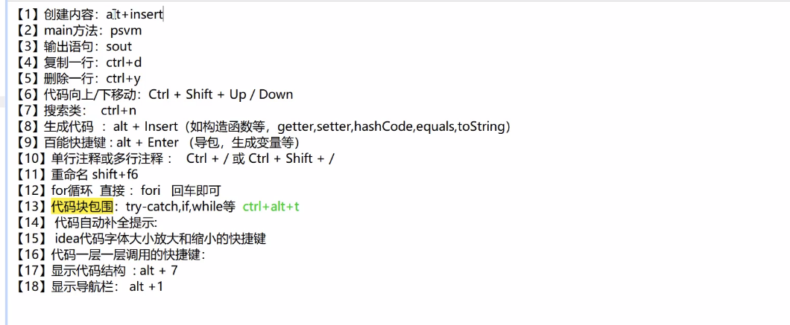
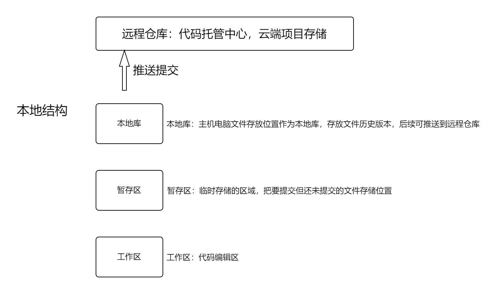
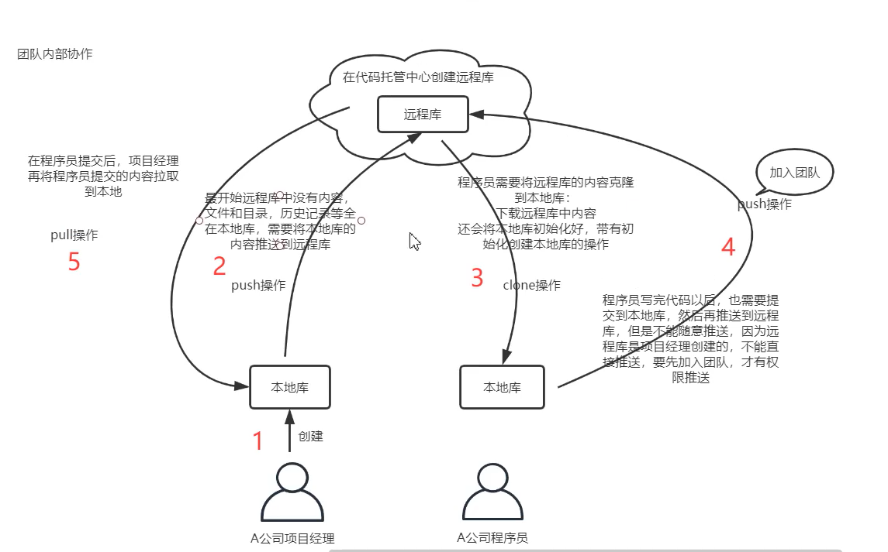
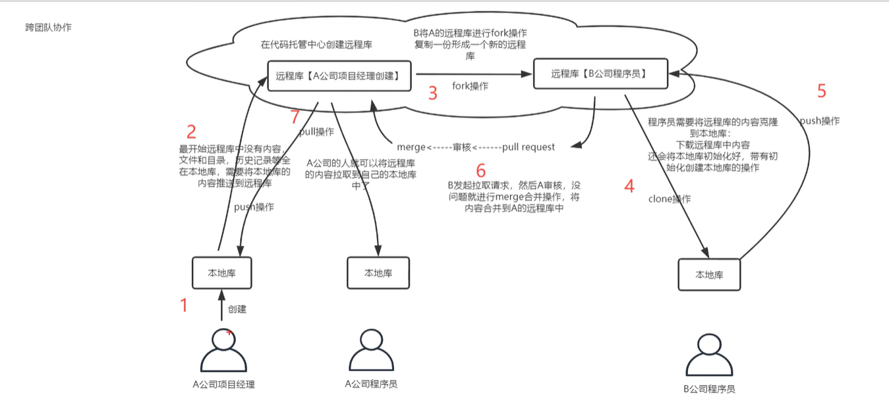
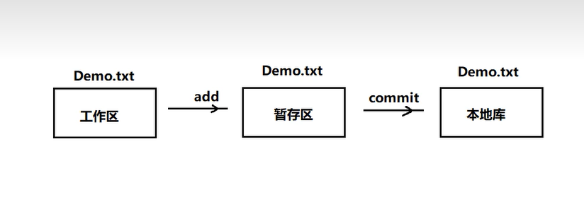
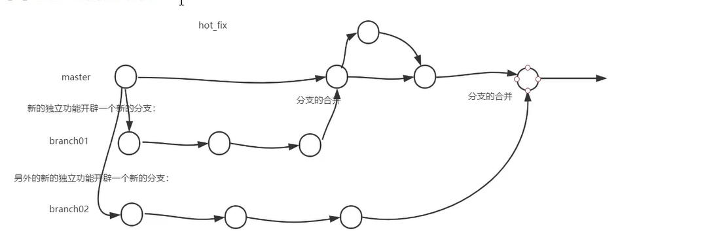

**_本文参考b站视频，做下笔记：https://www.bilibili.com/video/BV19p4y1W7kV/?p=27&spm_id_from=333.1007.top_right_bar_window_history.content.click&vd_source=7970fc9ea7ea3970cfbc8d47c9dadf4b_**

#1、idea配置快捷键

在设置中有两个代码模板，分别是实时模板(Live Templates)以及后缀补全(Postfix Completion)
其中实时模板可以做用户的个性化定制--后缀不全只能使用不能修改。

#2、版本管理工具简介

##2.1、rcs(本地版本控制系统)

**原理：** 在硬盘上(本地，local computer)保存补丁集(文件修订前后的变化)，通过所有的补丁，可以计算出各个版本的文件内容

.webp)

##2.2、svn(集中化版本控制系统)

**原理：** 在一个单一的集中管理的服务器(central server)，保存所有文件的修订版本。协同工作的人们都通过客户端连到这台服务器，取出最新的文件或者提交更新。

.webp)

##2.3、git(分布式版本控制系统)

**原理：** 客户端并不只提取最新版本的文件快照，而是把代码仓库完整地镜像下来。每一次的克隆操作，实际上都是一次对代码仓库的完整备份。

.webp)

    git利用极致的压缩算法，解压算法，将存储的量压缩到跟集中化的svn大不了多少，因此优势特性很突出

#3、Git使用简介

##3.1、安装与结构简介

安装：点击安装程序进行安装，在任何位置右键鼠标出现git bash here与 git gui here，可以打开使用即安装成功。

**本地结构：**

工作区 git add 到 暂存区 git commit 本地库  git push 到 远程仓库

----

**git团队内部合作：**

**git跨团队合作：**

----

##3.2、初始化本地仓库

    （1）、新建文件夹作为本地仓库
    （2）、在本地仓库中打开git bash here，右键可以打开选项设置git bash 界面的字符编码等。
        其中git的命令操作与linux中的一致：
                查看git版本：git --version
                清屏：clear
                设置签名：
                    设置用户名：git config --global user.name "flypig"
                    设置邮箱:git config --global user.email "uuFlypig@163.com"
    （3）、初始化：git init
注意：初始化后的.git文件目录下的文件不能轻易修改，保持不变

##3.3、提交文件到本地仓库

    （1）、准备好需要的文件，在本地仓库目录下，此时文件并没有与本地仓库的git相连接。
    （2）、git add Demo.txt将文件添加到暂存区
    （3）、将暂存区文件提交到本地仓库，创建文件与本地仓库的连接，文件受git管理：
            git commit -m "日志信息" 文件名
注意：不放在本地仓库中的文件，git是不进行管理。即使放在本地仓库的文件，git也不管理，必须经过add，commit命令操作才可以将内容提交到本地仓库。

##3.4、其他常用命令

    （1）、查看工作区与暂存区的文件状态(还没有添加到本地库的文件状态)：git status
    （2）、查看提交的、显示从最近到最远的日志：git log（当历史记录过多的时候，查看日志，需要分页查看，空格执行下一页，按键b执行上一页，尾页会显示END，q退出日志）
                          简洁的展示日志：git log --pretty=oneline 一行行的展示日志
                          更加简洁的展示：git log --oneline  一行行展示日志，且日志索引仅取前7位字母。 
                          信息增加的展示：git reflog（比上一个命令多了信息：HEAD@{数字} 数字的含义是指针回到当前这个历史版本的需要走的步数）
    （3）、前进或者后退历史版本：reset
            git reset 
                    hard参数： --hard + [版本索引]   本地仓库的指针移动的同时，重置暂存区，重置工作区
                    mixed参数：  --mixed + [版本索引]  本地库的指针移动的同时，重置暂存区，但是工作区不动
                    soft参数：   --soft + [版本索引]   本地库的指针移动的时候，暂存区、工作区都不动
    （4）、比对工作区与暂存区的文件差异：git diff + [文件名]  
            将工作区中的文件和暂存区中文件进行比较，删除使用-标记，添加使用+标记。
            （如不添加文件名，即不指定文件比对，比较的是工作区和暂存区中的所有文件的差异）
            git diff [文件版本索引] + [文件名]：如果添加索引，表示暂存区的文件与该版本的历史文件进行比对差异。
    （5）、查看已经存放到本地仓库的文件：git ls -files

  
注意：使用较多的都是第一种hard参数。
整体流程：将文件add到暂存区-->通过commit提交到本地库

##3.5、提交分支相关简介

(1)、分支是使用多条线同时推进多个任务。

(2)、分支带来的好处是可以并行开发，互相不耽误，互相不影响，提高开发效率

(3)、分支相关命令

    查看分支：git branch -v  (分支前方的*号表示现在所处的分支是哪个)
    创建分支：git branch (分支名称)  
    切换分支：git checkout (分支名称)
    合并分支：git merge (分支名称) ---在主分支的身份下执行合并

(4)、分支冲突问题

    问题缘由：在不同的分支中操作同一个文件，且修改的文件内容在同一位置，在合并分支文件的时候产生了冲突，git不知道如何保留文件，此时显示处于在合并状态中(master|MERGING)
    解决方法：与分支创建者沟通，保留某一分支内容，或者二者均保留，在执行合并分支的命令后，修改文件，将冲突修改，再提交。
            修改文件后，add到暂存区中，再提交，提交需要注意，命令为git commit -m "提交信息" --不需要接文件名称，直接提交，提交成功并退出合并状态。

注意：以上小节为git在本地仓库的使用，以下介绍GIT操作远程仓库。

----

##3.6、Git远程仓库操作简介

_以下为命令行方式操作_

    操作步骤：
            1、首先在GitHub或Gittee等远程仓库建立远程库,与需要推送的本地库同名
            2、复制远程仓库地址，在本地仓库的git命令行中创建地址别名：
                查看远程地址：git remote -v (查看已设置的远程地址)
                添加远程库地址：git remote add 别名(origin) + http地址(https://github.com/uuFlyPig/dailyStudy.git)
            3、推送远程库：git push 远程库别名(origin) +推送分支(master)
            4、克隆远程库：git clone +远程库地址
注意：克隆操作可以帮助完成三件事情，首先克隆下来的文件夹中已经初始化好了git本地库，其次将远程库内容完整克隆到本地，最后，将克隆下来的远程库地址创建好别名。

协同开发步骤：

    1、项目负责人创建远程库，将代码推送到远程库管理，项目负责人邀请开发人员加入团队(setting-->Access-->Collaborators-->Manage access)：路径
    2、开发者可以clone到本地进行开发，开发完毕后将代码再push到远程仓库(如未加入团队则push报错)
    3、开发者同步到远程仓库后，项目负责人本地的代码就与远程仓库有出入，需要拉取到其本地中查看代码，因此涉及到负责人从远程仓库中拉取到本地
        拉取：pull = (fetch + merge) ,fetch表示抓取的意思，merge表示合并的意思。
             git fetch 远程库别名(origin) + 分支(master):fetch仅将远程库内容下载到本地仓库中，但是并没有更新到本地工作区
             此时可以通过切换分支到远程仓库的中插卡看内容是否符合：git checkout origin/master
        进行合并：(切换回来后操作) git merge origin/master 即合并
        以上的抓取与合并可以通过一个命令pull完成：git pull 远程库(origin) master
        注意：fetch + merge操作--》保险，降低风险
             pull操作---》代码简单，便捷

协同开发分支提交产生的冲突问题：

    问题原因：不同的人操作同一个文件的同一个位置的时候，引起冲突
    解决方法：在冲突的情况下，先拉取下来，然后修改冲突，然后再推送到远程服务器，人为解决冲突。解决完后再推送，提交中不带文件名

**跨团队操作：**

    1、另一个团队需要将项目fork复制到自己的远程库中，团队程序员克隆远程库的项目到本地库中，下载远程库的同时还会将本地库初始化好，带有初始化创建本地库操作
    2、当另一团队开发完后，提交到自身远程库，再通过远程库的推送请求，pull request给本团队审核进行merge。

**SSH免密登录方式：**

    (1) 进入用户的主目录中(cd ~)
    (2) 执行命令，生成一个.ssh的文件---ssh-keygen -t rsa -C +github注册账号对应的邮箱
    (3) 复制.ssh目录下的id_rad.pub文件，将公钥复制到github上，在github  setting上设置SSH Keys
    (4) 在github上生成密钥后，就可以正常进行push操作了
    (5) 可以对ssh远程地址起别名：
            git remote origin_ssh + ssh密钥

----

##3.7、idea集成git

**_本地仓库交互：_**

    1、创建项目，在设置中配置git路径等。创建的一个项目就是工作区，项目所在目录就是本地仓库所在目录
    2、在idea界面中选择VSC创建git仓库，即可完成本项目初始化，生成.git目录。
    3、提交方式：
            右键新建的文件，选择git添加，即可添加到暂存区，再次点击提交即可提交到本地仓库，再次点击推送即可推送到远程仓库(需要配置远程仓库地址)
            文件如未添加到暂存区则是微红色显示，如添加到暂存区还未提交到本地仓库则是绿色，如提交到本地仓库后则是正常颜色，且在文件中如修改了文件则会有提示差异代码

**_远程仓库交互：_**

    1、如需要在idea中实现本地仓库与远程仓库进行关联，可以先把远程仓库拉取下来，然后再推送到远程仓库中达到合并目的。
    2、需要注意：远程仓库与本地仓库实现关联进行拉取的时候，因为是不同的两个项目需要添加依据代码，在git pull之后
            git pull origin(仓库地址) master(仓库分支) --allow-unrelated-histories
        此命令告诉git允许不相关历史合并，解决了两个仓库有不同的开始点，也就是两个仓库没有共同的commit出现的无法提交的问题。
        如使用此命令还无法提交，则看看是否是产生了冲突，解决冲突后再提交。
    3、push推送：git push -u origin master -f

