**_本文参考来源：https://mp.weixin.qq.com/s/FnH-J_OBHPFjpG3ufo1e8g_**

#1、湖仓一体架构演进

##1.1 概念

    数据仓库：将来自业务系统的多种结构化数据聚合到数据仓库中，利用 MPP 等大规模并发技术对企业的数据进行分析，支撑上层的商业分析和决策，主要处理结构化数据。
    数据湖：数据湖可以被定义为一种存储各类原始数据的存储库，原始数据包含结构化、半结构化以及非结构化数据。一部分原始数据会经过 ETL 同步到数据集市中，支撑商业分析和决策类应用，另一部分数据将被机器学习和数据科学类应用直接访问。

| 数据仓库                                            | 数据湖                                                                     |
|-------------------------------------------------|-------------------------------------------------------------------------|
| 主要处理历史的、结构化的数据，而且这些数据必须与数据仓库事先定义的模型吻合。          | 能处理所有类型的数据，如结构化数据，非结构化数据，半结构化数据等，数据的类型依赖于数据源系统的原始数据格式。非结构化数据（语音、图片、视频等） |
| 处理结构化数据，将它们或者转化为多维数据，或者转换为报表，以满足后续的高级报表及数据分析需求。 | 拥有足够强的计算能力用于处理和分析所有类型的数据，分析后的数据会被存储起来供用户使用。                             |
| 数据仓库通常用于存储和维护长期数据，因此数据可以按需访问。                   | 数据湖通常包含更多的相关的信息，这些信息有很高概率会被访问，并且能够为企业挖掘新的运营需求。                          |
    湖仓一体阶段：主要指在数据湖中建设存储、湖上建仓。

**湖仓一体的优势特性：**

● 支持事务：在企业中，数据往往由业务系统提供、并发读取和写入，对事务性要求高。由于一部分业务在读取数据，同时另一部分业务在写入数据，需要保证在并发过程中数据的一致性和正确性。

● 支持数据模型化和治理，并在数据湖上建设数仓模型：如星型、雪花模型都可以在数据湖上构建，进一步支持上层商业智能类应用，并对接多种BI类工具。

● 支持存算分离：数据湖中有海量数据，如果存储在数仓等系统中会非常昂贵，因此需要存储在对象存储等较便宜的存储系统中。利用湖仓一体这种架构，实现存算分离模式。

● 更好的开放性：支持 Parquet、ORC 等常见的大数据存储格式，也支持 Hudi、Iceberg、DeltaLake 等表格管理存储格式，支持结构化、半结构化和非结构化等数据类型，支持不同类型的工作负载等。

● 生态工具与组件丰富：围绕数据湖也出现了很多相关工具和组件，如数据目录、开发工具、隐私计算、元数据管理等，其中以 Hudi、Iceberg、DeltaLake 这三种数据湖存储格式最为流行。

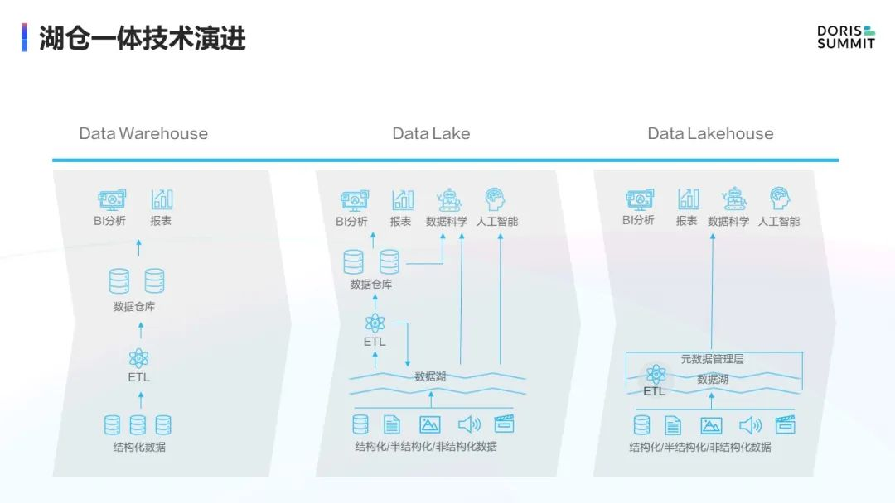

**湖仓一体的缺点：**对实时性支持不足。如果我们把数据湖和实时数仓进行融合，利用实时数仓的快速分析能力去查询数据湖中的海量数据，势必将会给企业带来更高的价值。

**数据湖和实时数仓具备不同特点：**

● 数据湖：提供多模存储引擎，如 S3、HDFS 等，也支持多计算引擎，如 Hive、Spark、Flink 等。在事务性方面，数据湖支持 ACID 和 snapshot 等方式。同时，数据湖提供了 Hudi、Iceberg、DeltaLake 等表格式的定义，也支持结构化、半结构化和非结构化数据。

● 实时数仓：提供实时指标的聚合，数据可以秒级入库。实时数仓的分析能力也较强，支持秒级和亚秒级的数据分析，支持多维分析和联合分析。对外可以提供高并发数据服务，如 Doris 可以提供万级 QPS 的数据服务，也提供数据更新能力。

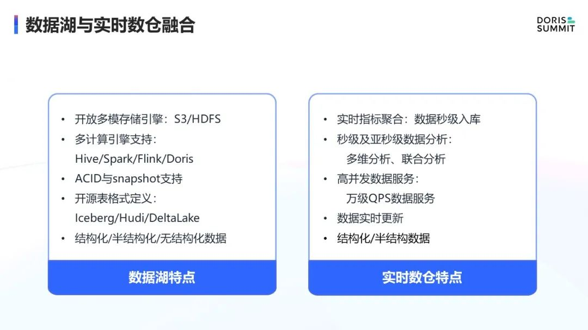

    结合数据湖和Doris特性：
        既可以利用数据湖中存储的海量数据
        又可以利用 Doris 向量化分析能力加速海量数据的洞察效率
        利用 Doris 提供高并发数据服务和数据更新能力

#2、数据湖联邦分析底层架构

##2.1 Multi-Catalog的架构设计

    数据湖联邦分析架构采用 multi-catalog模式，由外表的方式转为catalog的方式，如下所示：

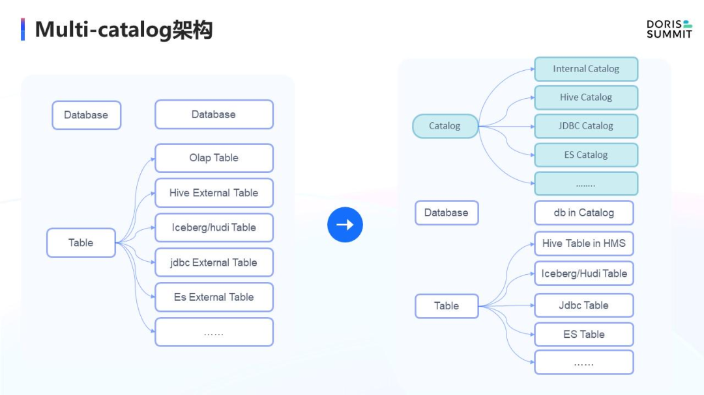

**初始架构：**

    原本 Doris 采用两层架构，一层是 Database、一层是 Table。先创建 Database，再创建各种 Table。
    除了 OLAP 内表模式外，还支持创建各种类型的外表，如 Hive 外表、Iceberg 外表、JDBC 外表和 ElasticSearch 外表等。
    基于 Doris 原生外表模式，也可以访问数据湖中的数据源，但存在如下缺点：
        ● 首先需要在 Doris 中创建外表，创建时还需要制定 Schema。如果外部数据源多，一个一个在 Doris 中进行创建就显得非常繁琐和不便。
        ● 如果外部数据源，如 Hive 中的 Schema 发生了变更，那 Doris 中对应的表就需要重建，否则查询就会失败。

**架构改进：**

    针对以上问题，我们参考数据库的设计理念，增加了 Catalog 一层，将原有的 Database 和 Table 挂在 Internal Catalog 下，目前已经实现了 Hive Catalog、JDBC Catalog 和 ElasticSearch Catalog。
    在该架构下，增加新的 Catalog 会非常便捷。在 Catalog 下，通过 Create Catalog 可以方便地创建 Hive Catalog。创建完成后，即可切换到 Hive Catalog 中，通过 Show Database、Show Table 来查看 Hive 对应的 Database 和 Table。
    在 Show Database 时查看的 Database，即 Hive Catalog 下的 Database，也就是 Hive Metastore 中的 Database 列表。我们在某个 DB 下 Show Table，也可以看到该 DB 下的 Table，同样和 Hive Metastore 保持一致，无需创建外表。其他类型的 Catalog 也类似。

##2.2 Multi-Catalog的元数据技术原理--和外部元数据的连接简介

_以 Hive MetaStore举例,Catalog 与外部元数据对接_

**设计思路:**

    1、我们已经添加了 Hive MetaStore这一类型的 Catalog，可以动态添加、删除和切换 Catalog。通过 Create Catalog，将 Type 指定为 Hive，指定 Hive Catalog 的地址，即可完成创建。
    2、通过 Drop 和 Switch 命令也可以很容易地进行删除和切换。在 Doris 中无需创建外表，执行 Show Database 和 Table 的时候，FE 会连接至对应的 Hive MetaStore，来查询其中的 DB 和 Table。获取到 DB 和 Table 之后，再由 FE 返回客户端。
    3、当制定 Select 查询操作时，FE 会连接到 Hive MetaStore 来获取该 Table 下的元数据信息，包含它的 Schema、Location、格式等信息，完成查询规划，进而完成查询。
    4、对从 Hive MetaStore 中获取的元数据进行缓存，来加速查询。JDBC Catalog 和 ES Catalog 也是类似的方式，会分别连接到外部的 JDBC Server 和 ES Server 来进行元数据获取。

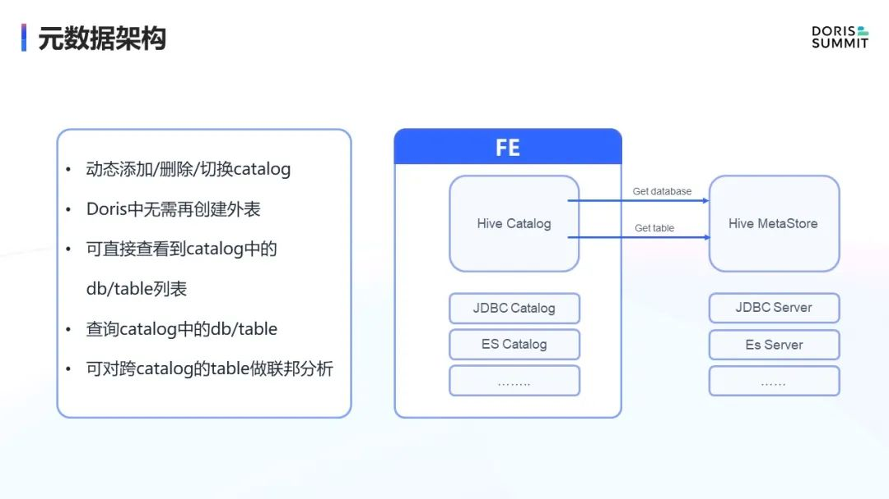

**在这种统一的数据查询框架下,开发新数据源的方式：**

    1、当前我们已经内置提供了 Hive、JDBC、ES等数据源。添加新数据源时，只需关心数据源自身的访问相关操作，增加新的 ScanNode。例如，在 Hive、JDBC、ES 的设计中，分别内置了 FileScanNode、JDBCScanNode 和 ESScanNode。
    2、在统一的调度框架下 Scanner Scheduler 下，我们会将 ScanNode 产生的 Scanner 提交到 Scanner Thread Pool 进行扫描查询。
    3、对于 Hive 的 FileScanNode 来说，大多数情况是读取外部存储系统的文件，我们提供了 Parquet Reader、ORC Reader 和 TEXT Reader，支持对Parquer、ORC、 JSON 和 CSV 进行读取。
    4、对于 Scan 之上的操作，我们完全无需关心，因为 Scan 产生的这种 Block 数据可以直接被上层应用进行向量化查询。在 Scan 层面，我们也增强了基于代价的查询优化器，可以根据统计信息进行查询优化。
    5、在算子优化方面，我们也针对 Predicate Pushdown，Join Runtime Filter 和 Streaming Aggregation 等进行了优化。

##2.3 Multi-Catalog的查询框架

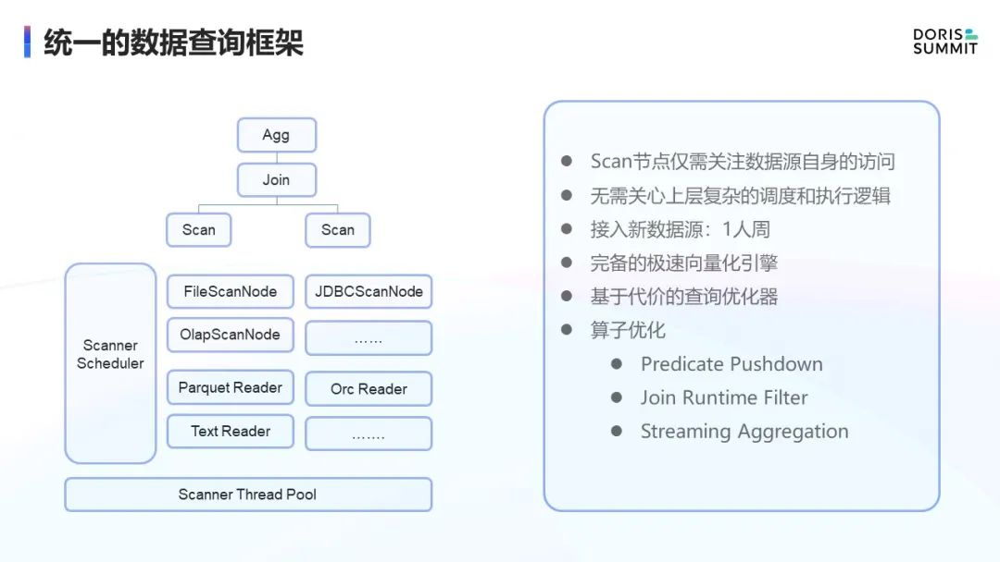

**查询的完整流程：**

比如执行一个查询，Select * from Hive Catalog 中的 DB1 下的 Table1 的流程。

    第一步，对于这样的查询，在 FE 中会首先连接到 Hive MetaStore ，获取 Table 相应的元数据。元数据中包含Schema 信息。
    第二步，如果分区表，也会获取相应的分区。如果过滤条件中包含分区过滤条件，也会将过滤条件传递到 Hive MetaStore 中，减少返回的分区大小。
    第三步，对返回的元数据信息进行分区裁剪和计划生成。分区裁剪完之后，我们会根据元数据信息链接到 HDFS 或 S3 中获取文件列表。获取到文件列表后，会进行计划生成，该生成逻辑和原有的逻辑类似。
    第四步，生成完之后，我们会对任务进行拆分和下发，下发到 BE 中执行。对于下发的任务，BE 会基于 FE 下发的信息，直连 HDFS 和 S3 进行文件读取，读取效率非常高。

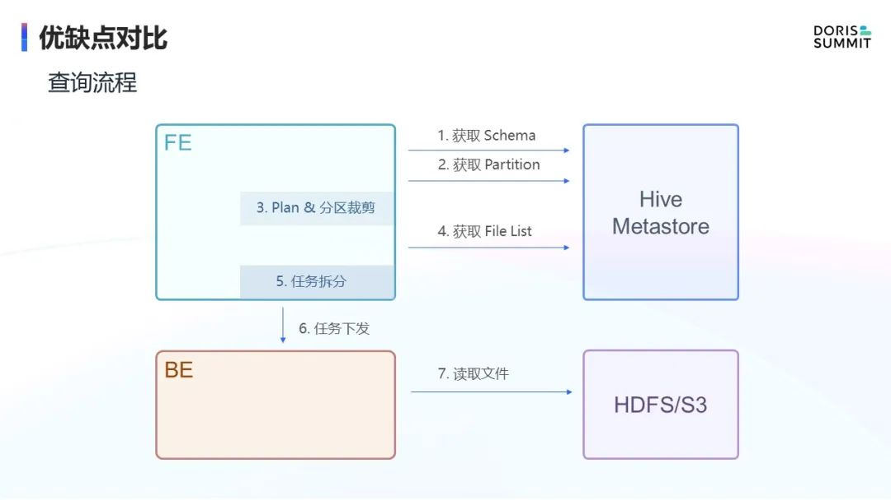

**字节跳动也对查询过程的优化：**

**(1)FE 中缓存的相应元数据信息**

    ● 在缓存方面，我们在 FE 中实现元数据缓存，主要缓存 Db/Table 信息、Table 分区信息、Table 分区值信息和 File list 信息。Schema Cache 主要是指 Get Table 的时候，如果此时 FE 不存在对应 Table 信息，需要连接到 Hive MetaStore 获取 Table 的元数据信息，包括 Schema 和 格式。
    ● 相关信息获取完后，我们会把信息维护在 FE 的内存中。当再度访问相同 Table 时，可直接使用内存中的元数据信息，减少多次 RPC 调用，提高查询效率。
    ● 如果是分区表，我们也提供 Partition Cache 、Partition Value Cache以及 File Cache，其中File Cache 是指 File list，并不是文件的数据内容。
    ● 在查询规划方面，我们会连接存储系统，获取到相应的 File list，并将该信息维护在 FE 缓存中，进行查询加速。

**(2)在BE端，也实现了一部分缓存信息：**

    ● 第一， Prefetch Buffer 功能。在 BE 去查询 HDFS 和 S3 数据时，如 Parquet 或者 ORC 格式，会进行跳跃式读取。读完当前 Block ，读下一个 Block 时，我们会对 IO 做合并，一次读取多个 Block 信息，减少 RPC 调用。读取完数据，后续查询可以直接利用已读取的数据。
    ● 第二， 维护File Block Cache。读取完 Parquet 文件中数据后，我们会对 Block 数据进行本次缓存，下次再查询相同文件时，可以充分利用本地这份缓存，减少和远端存储系统交互，提高查询效率。

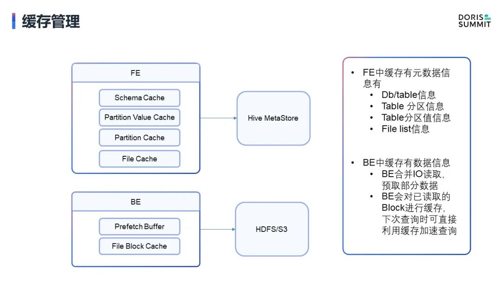

**(3)对FileReader进行重构**

未重构前的问题：

    ● Arrow Parquet Reader 读取数据时会先做一层内存转换，把 Parquet 文件数据转换成 Arrow 这种内存格式。然后，Doris 会再做一次转化，将其转为 Doris 使用的向量化的 Block 内存格式。这就造成了多一次的内存转换。
    
    ● 无法使用 Parquet 中的 Page Index，导致读取效率较低。
    
    ● 无法使用 Parquet 中的 Bloom Filter，在部分查询有过滤条件时，将导致读取效率不高。
    
    ● 不支持字典编码。

针对上述问题进行重构，重写Native Parquet Reader，具备以下特点：

    ● Native Parquet Reader 读取数据会直接转化为 Doris 使用的向量化的 Block 内存格式。下游进行计算时可以直接利用这种格式，避免二次转换。

    ● 可以利用 Parquet 中的 Page Index，能够更精确地过滤掉无用数据，降低数据 IO。
    
    ● 可以利用 Parquet 中的 Bloom Filter 来过滤数据，提高查询效率。
    
    ● 支持字典编码和延迟物化，比如性别男和女在文件存储中使用0和1。

我们设置过滤条件只查询性别为男的数据，常规的读取方式会先把文件存储中的0和1数据用字典解码为性别男和女。然后，再将男和女的字符串和过滤条件进行比较，保留性别为男的数据。
这种模式因为有字符串的参与，效率会非常低。在我们这次重构中对此进行了优化，在设置过滤条件时可以通过字典知道对应数据是0，所以查询中直接可以使用 0 这个 int 类型数据来进行读取和延迟物化，从而提供查询效率。
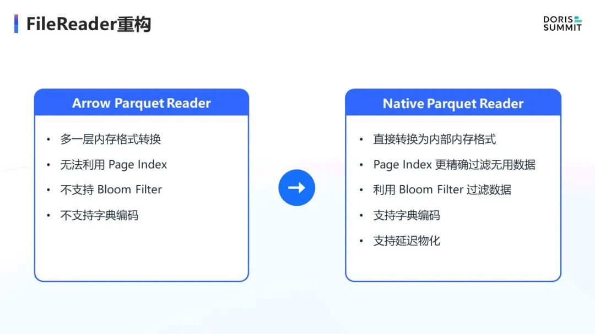

**(4)Compute-Node计算节点**

    增加弹性计算节点
        原始的 Doris 中，BE 节点是存算一体的，提供 Local Storage 这种存储引擎，如 OLAP 表就存储在本地。但在数据湖联邦分析场景中，我们查询远端数据湖数据时是不需要 Local Storage 这种本地存储的，因为数据湖中数据量较大，会造成 BE 节点扩容。
        因此，我们增加了无状态的 BE 节点，即 BE Compute Node，可以快速进行扩容，增加计算负载，提高数据湖查询效率。在弹性场景中，这个特性会非常有用。

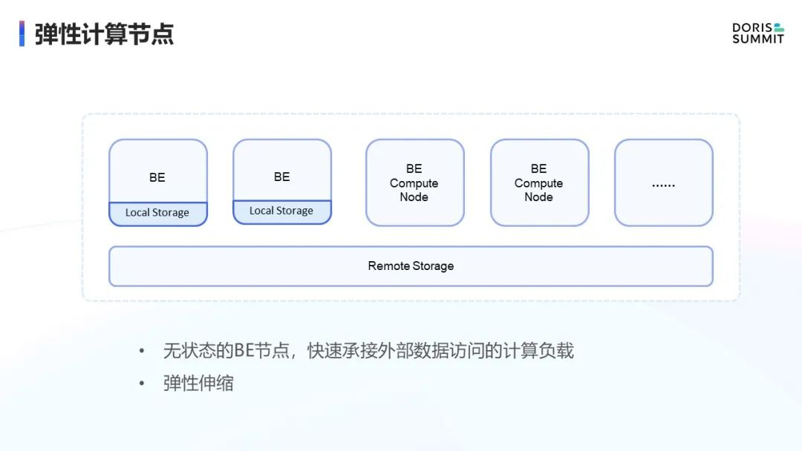

#3、数据湖联邦分析未来规划

##3.1、增强数据湖Index

增强 Iceberg/Hudi Index

    Hive、Spark、Presto、Flink等引擎已经针对 Iceberg/Hudi Index 做了很多相关优化，这些引擎与数据湖已经有比较紧密的结合，各种优化与加速手段相对比较完善。

    但对于 Doris 这种新接入的引擎来说，对于 Iceberg/Hudi Index 的支持还不是很完善，我们计划对其进行增强。在 FE 查询规划阶段，充分利用 Iceberg/Hudi metadata 中的 Index 信息进行查询过滤，减少数据扫描，提升查询效率。

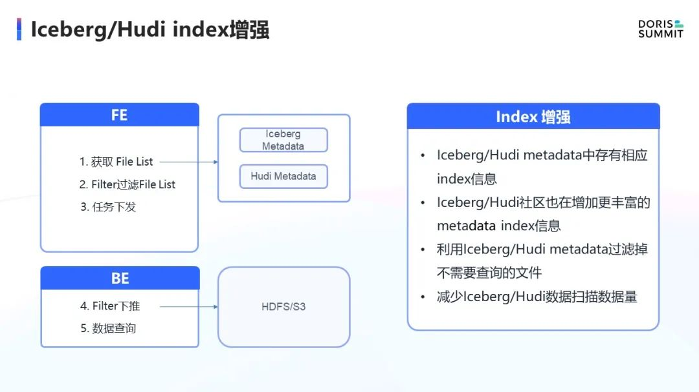

增强数据湖写入能力 DataLake Sink

当前，针对 Hive、Iceberg、Hudi 仅支持查询，计划做以下增强：

    ● 针对 Hive 表，增加 Parquet/Orc Writer 和 CSV/JSON Writer，支持对 Hive 表的 Insert 操作。
    
    ● 针对 Iceberg 表，增加 Parquet/Orc Writer 和 Iceberg metadata commiter。
    
    ● 针对 Hudi 表，增加 Parquet Writer 和 Hudi metadata sync。

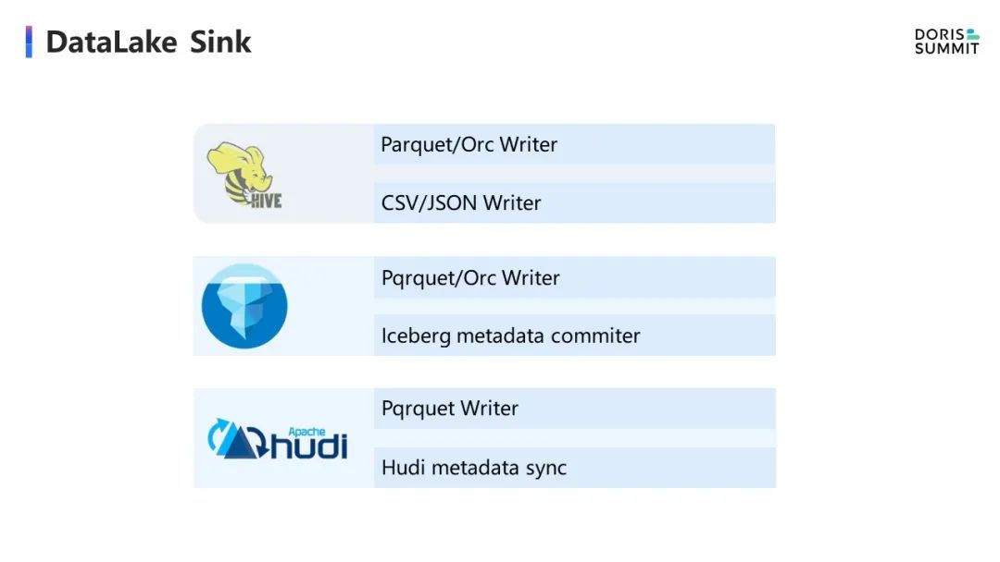

##3.2、Iceberg metadata center

    增加 Doris Iceberg metadata center，期望 Doris 可以作为 Iceberg 的元数据维护中心，也希望这个功能可以提供给 Doris 之外的引擎。
    
    目前 Iceberg 元数据维护在 HMS 或 HDFS 中，这种模式下操作效率较低。我们期望由 Doris FE 维护 Iceberg 的元数据信息，接收变更、读取、查询等。
    
    在这个模式下，首先 Doris 可以完成Iceberg 的数据查询加速，另外其他引擎的变更也可以统一提交至 Doris 维护的 Iceberg 的元数据维护中心，实现统计信息的全面维护和查询效率的提升。

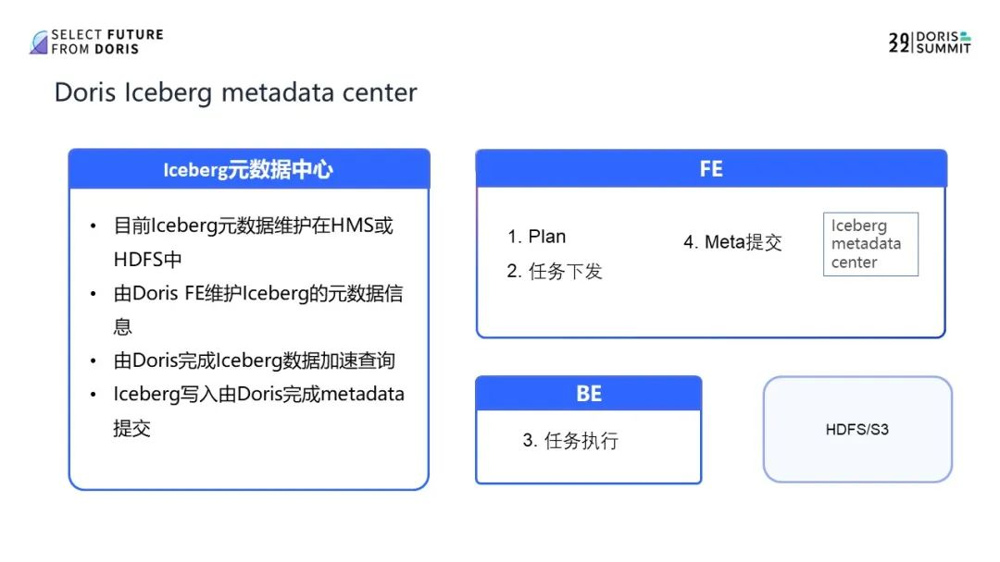
